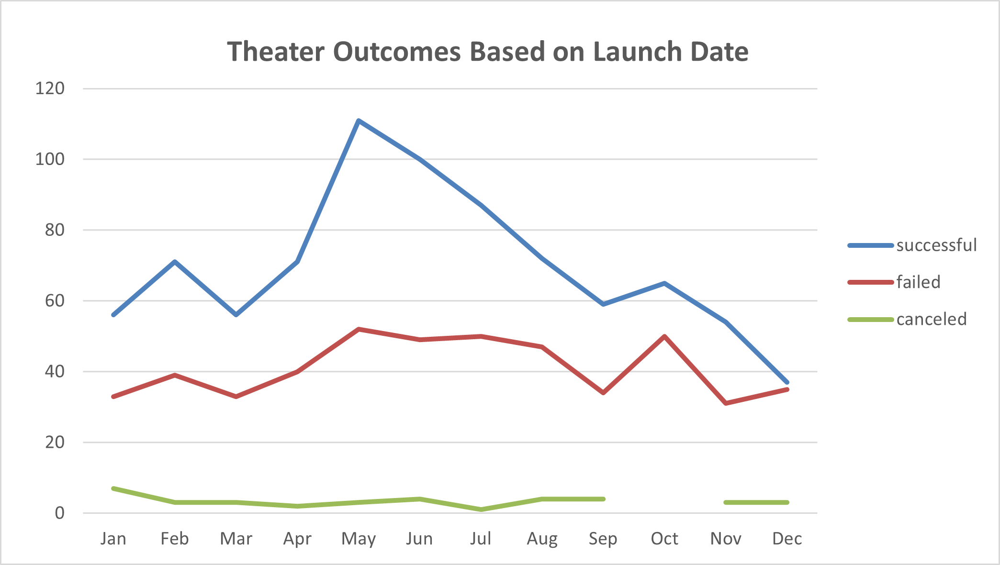

# Analysis of Kickstarter Outcomes for Theatrical Productions

## Overview of Project
Based on a previous analysis of crowdfunded campaigns for our client, Louise, we were asked to use the same data to uncover information regarding the outcomes of crowdsourced campaigns based on launch date and the goal amount of each campaign. The information from this analysis will assist the client in achieving a successful Kickstarter campaign.

### Purpose
Our objective was to create two analyses based on Kickstarter data for the purpose of assisting our client in making decisions that positively impact their crowdfunding campaign. The first analysis was to compare campaign outcomes to their launch date and the second was to compare outcomes by their funding goal.

## Analysis and Challenges

The dataset used contained 4114 different Kickstarter campaigns between 2009 and 2017. Using Excel functions and pivot tables we were able to sort through the data to find some insights on the performance of these campaigns.

### Analysis of Outcomes Based on Launch Date

In order to check outcomes based on launch date, a new column was created to extract the year that each Kickstarter campaign began. A pivot table was created with columns for the outcomes and rows separated into months. A filter was used to show only campaigns with the parent category 'theater'. It was found that among 1369 theater campaigns, 893 were successful, 493 failed, and 37 were canceled. The month that had the most successful campaigns was May and the month with the least successful campaigns was December.

### Analysis of Outcomes Based on Goals

 For outcomes based on goals, a new sheet was created for the statistical analysis. The rows were broken into cost ranges, starting with less than $1000, $1000-$4999, increments of $5000 to $49999, and anything equal to or greater than $50000. For each range, the count of successful, failed, and canceled projects was counted. This was done using the COUNTIF() function using the subcategory 'plays'. The percentages were taken and used to draw the conclusions shown in the results section. 

### Challenges and Difficulties Encountered

The analysis portion was straight forward and the data was very clean, so there wasn't much difficulty finding results that provided insights. Some issues that we may have run into would have be incorrect data types, currency conversions, or missing data.

## Results

From the analysis there were several results that could prove useful in planning a Kickstarter campaign for theater groups attempting to fund plays through crowd sourcing.

### Launch Date Insights

In the analysis it was found that the month of May not only had the highest number of launched campaigns, but also the highest number of successful campaigns with over twice as many successful campaigns to failed campaigns. December was the weakest month with the lowest number of launched campaigns as well an almost equal number of successful campaigns to failed campaigns. If a campaign could not be launched in May, the summer months of June and July also had a higher number of successful campaigns to failed campaigns.

### Outcomes vs Goals Insights

Looking at the ranges of the Goals, we can see that most campaigns had goals less than $5000. Goals less than $15,000 were more likely to be successful, but the smaller the goal the more likely it was to succeed. After $15000, the rate of failed campaigns is greater until $35,000, at which point the percentage of successful campaigns seems to higher until $45,000 where the percentage of failed campaigns increases dramatically.

### Limitations of the Dataset
Despite the cleanliness of the Dataset as provided, there are several limitations that should be noted. For one, the Launch dates end in 2017, so the data is several years old and may not reflect the current environment for crowd sourcing campaigns. Public policy or the popularity of crowd funding may have changed over time affecting the impact these results may have for current campaigns. Another limitation specifically regarding campaign goals could be the number of campaigns with goals over $5,000. The number of campaigns reduces significantly at higher ranges. For the ranges $35,000-39,999 and $40,000-44,999 there appears to be a significant increase in the percentage of successful campaigns, however there are only 6 and 3 campaigns in these ranges so there is much less data to work with versus the lower ranges. 

### Other Considerations
It may also be useful to have a table showing the number campaigns for each year to see how the popularity of crowd funding has changed. There may also be a benefit in comparing the Launch Date and Goal by country, as the client is looking at different locations. Comparing the average number of backers to Outcomes through different ranges may help identify a target for outreach and could be combined with a stacked bar chart to analyze outreach.
